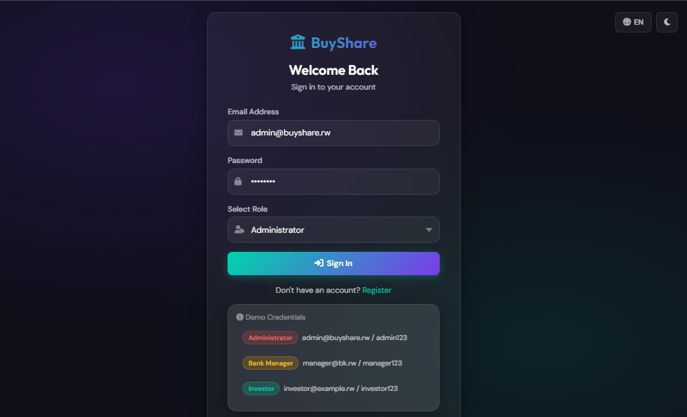
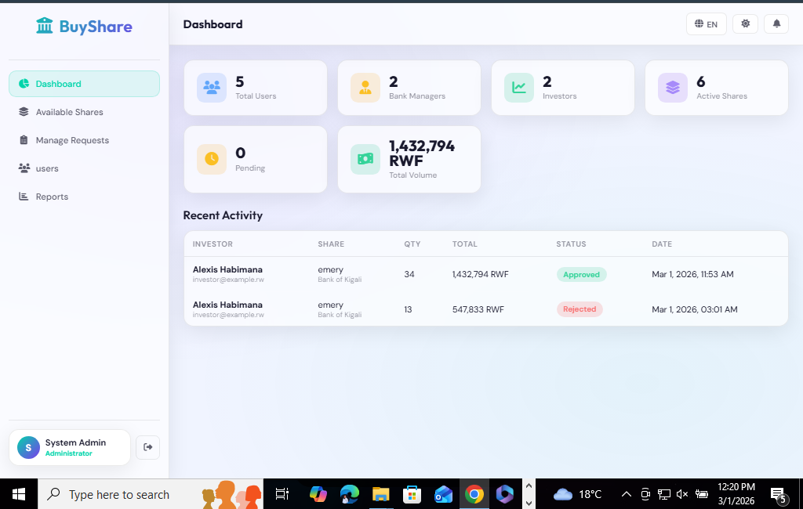
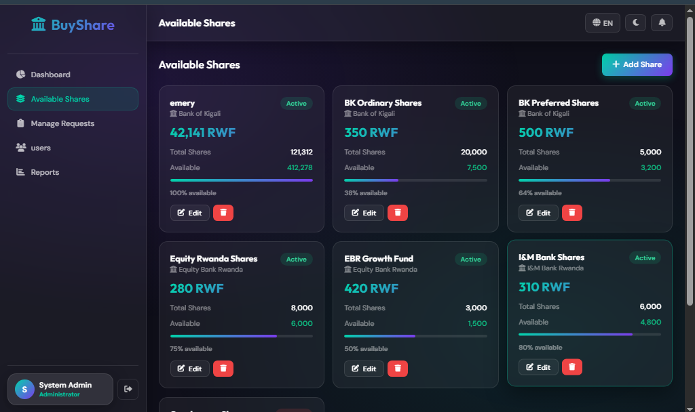
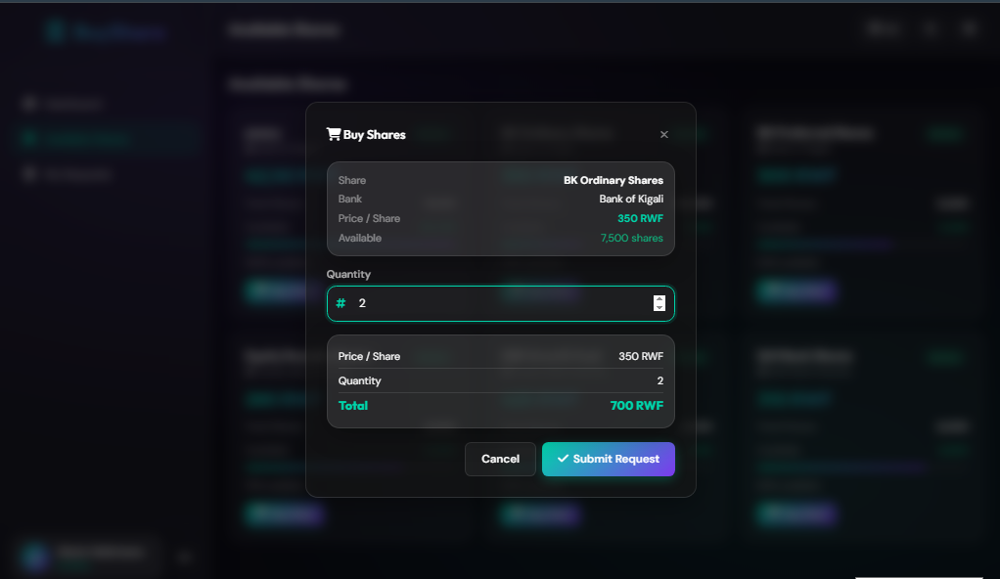
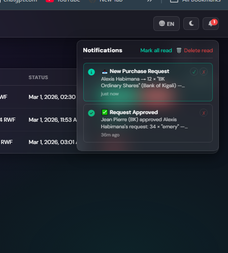
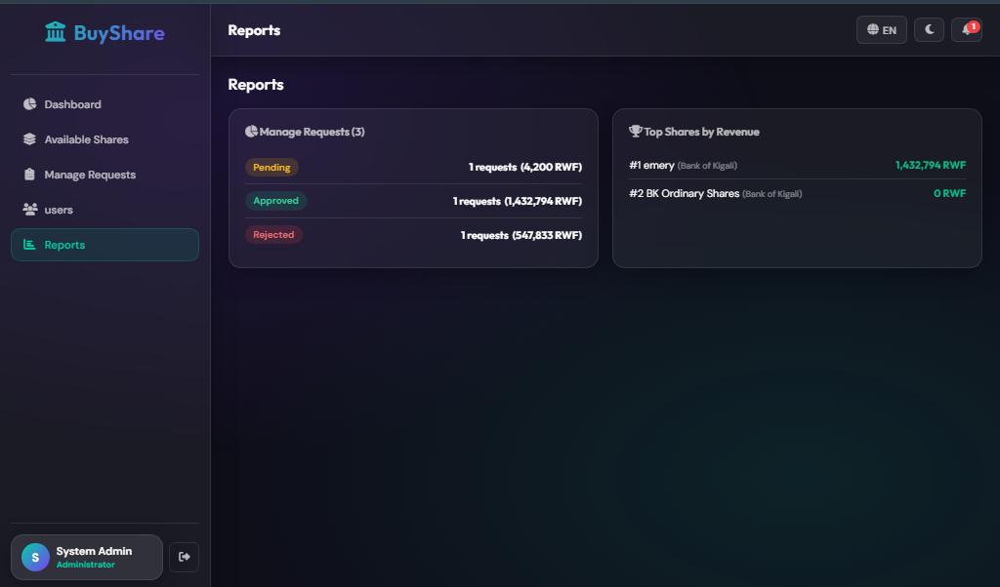

# 🏦 BuyShare v2 - Bank Share Investment Platform


**BuyShare** is a digital platform that connects **investors** with **banks** for purchasing shares in a secure, reliable, and modern way.

---

## 📸 **DEMO**

> *Place your system screenshots here* (see instructions below)

| Login Page | Dashboard | Shares Management |
|------------|-----------|-------------------|
|  |  |  |

| Buy Shares | Notifications | Reports |
|------------|---------------|---------|
|  |  |  |

---

## ✨ **Features**

### 👤 **Users**
- **Admin:** Manage system, bank managers, reports
- **Bank Manager:** Manage bank shares, approve/reject requests
- **Investor:** Register, purchase shares, track requests

### 🔒 **Security**
- Passwords hashed with bcrypt (12 rounds)
- Data at rest encrypted with AES-256-GCM
- Rate limiting (max 30 attempts/15 min)
- Account lockout after 5 failed attempts
- Session security (httpOnly, sameSite)
- SQL injection protection (parameterized queries)
- XSS protection (helmet + CSP)
- Audit logs for all actions

### 🌐 **Internationalization**
- 🏴󠁧󠁢󠁥󠁮󠁧󠁿 English
- 🇷🇼 Kinyarwanda

### 🎨 **UI/UX**
- Dark/Light theme toggle
- Glassmorphism design
- Responsive (mobile friendly)
- Real-time notifications
- Toast messages

---

## 🚀 **Quick Start**

### **Prerequisites**
- Node.js v18+
- MySQL v8+
- npm or yarn

### **Installation**

```bash
# 1. Clone repository
git clone https://github.com/Kellokent3/buyshare.git
cd buyshare

# 2. Install dependencies
npm install

# 3. Setup database
mysql -u root -p < database.sql

# 4. Create .env file (copy from example)
cp .env.example .env
# Edit .env with your credentials

# 5. Start server
npm start"# buyshare" 
